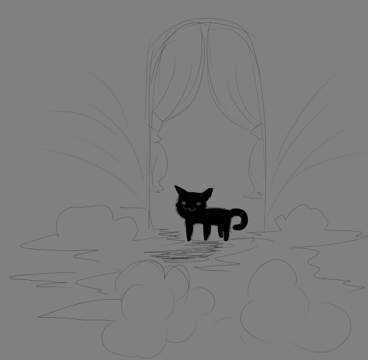

# Meidaku
Meidaku - это проект созданный Dr Rob`ом и после вместе с Недом. Сайт рассказывает о проекте эрагон,
а так-же функции так называемого бумажного чата(на данный момент идет верстка).

## Содержание
- [Meidaku](#meidaku)
	- [Содержание](#содержание)
	- [Что использовали](#что-использовали)
		- [Зачем вы разработали этот проект?](#зачем-вы-разработали-этот-проект)
	- [To do](#to-do)
	- [Команда проекта](#команда-проекта)
	- [Источники](#источники)

## Что использовали
- Back-end - Django, django-channels
- Front-End - JavaScript, html, css
- Кэширофание - redis

<!-- ## FAQ  -->

### Зачем вы разработали этот проект?
Чтобы был.

## To do
- [x] Добавить папер-чат
- [ ] Всё переписать
- [ ] Обработка и сжатие фото для автарок

## Команда проекта
- Ned - Back-end
- Dr Rob — Front-End

## Источники
Вдохновление на голову Dr Rob пришло довно, он хотел сделать заметки и прогресс в развитии своего проекта "Эрагон". Но так-же ему хотелось сделать функцию чата, для написания кому либо.

        
